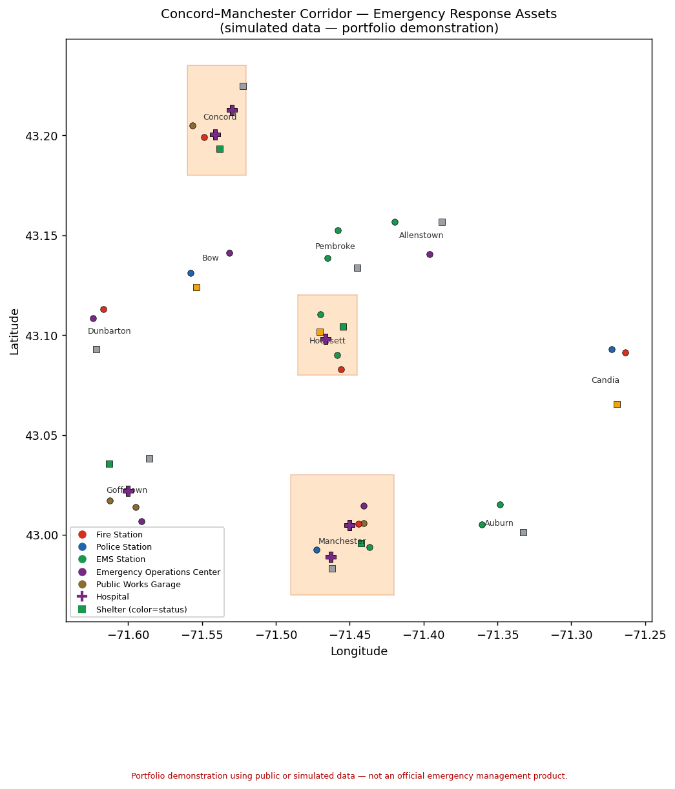
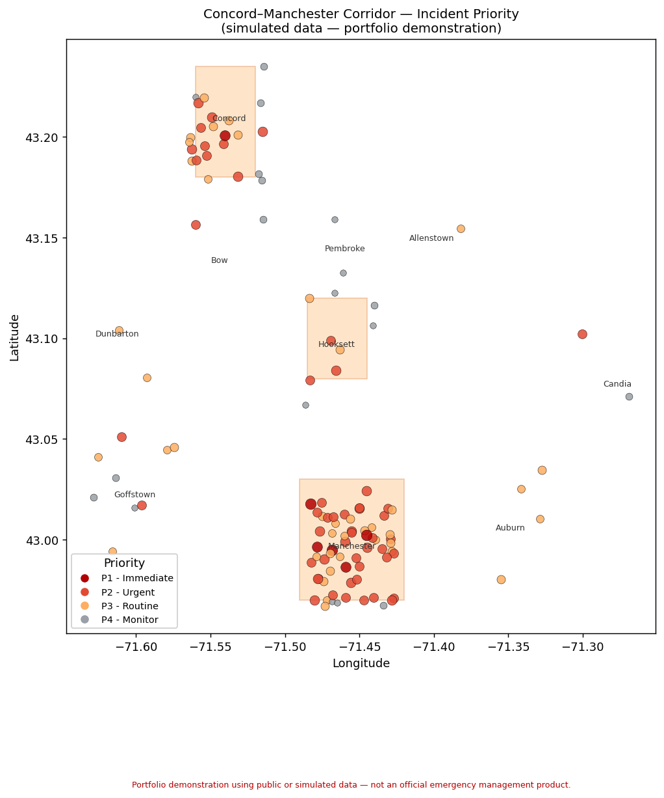
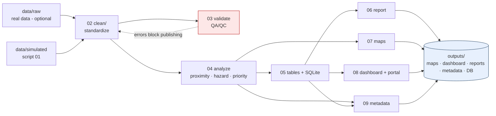

<div align="center">

# 🛰️ Public-Safety GIS Sandbox

### Concord–Manchester, New Hampshire corridor

**A hands-on project exploring how GIS supports emergency planning — clean → validate → analyze → map → dashboard → report — using a simulated New Hampshire corridor.**

[](https://ajcondondev.github.io/public-safety-gis-sandbox/)
[](https://github.com/ajcondondev/public-safety-gis-sandbox/actions/workflows/ci.yml)
[](https://www.python.org/)
[](LICENSE)
[](tests/test_pipeline.py)


</div>

## What this is

I'm genuinely curious about how GIS supports public safety and emergency management, and the way I learn best is by building. So I made this — a hands-on exploration of the full geospatial workflow behind emergency planning: **clean → validate (QA/QC) → spatial analysis → maps, an interactive dashboard, a SQL database, and reports** — set in a simulated Concord-to-Manchester, New Hampshire corridor.

It's a **learning project**: a way to actually work through the concepts, tools, and trade-offs in this field instead of just reading about them — and to explain what I found along the way. Everything runs from Python in seconds, and **all data is simulated and safe** (no real 911 or private data).

- 🔍 **Curious how public-safety GIS works?** It walks through the ideas concept by concept — start with the [Learning guide](docs/learning_guide.md) and [Glossary](docs/glossary.md).
- 🗺️ **Just want to see it?** 👉 **[Open the live demo](https://ajcondondev.github.io/public-safety-gis-sandbox/)** — the interactive map, dashboard, and reports, right in your browser (no install, no GIS software). Locally it's `outputs/index.html`.
- 🧰 **What it touches:** data engineering, QA/QC, spatial analysis, SQL, dashboards, automation, and documentation — end to end.

> **⚠️ This is a personal learning / portfolio demonstration using public or simulated data. It is not an official emergency management product and should not be used for operational decision-making.**

Along the way it works through the kind of tasks involved in public-safety and emergency-management GIS — collecting and cleaning geospatial data, modeling it, validating its quality, running spatial analysis, automating the workflow, and producing map- and dashboard-ready outputs with clear documentation.

I used the **Concord → Manchester, New Hampshire** corridor (along I-93 / NH-3) to keep it concrete. The work is inspired by how GIS supports state emergency services and communications — including roles such as a **GIS Solutions Engineer** — but it's a project I built to learn, not something tied to any specific employer or position.

### 📸 Preview

| Regional response assets | Incident priority |
|:---:|:---:|
|  |  |
| *Fire / EMS / police / EOC / public-works facilities, shelters (by status), hospitals, and simulated hazard zones.* | *120 simulated incidents scored and ranked P1–P4 by severity, status, hazard exposure, and facility distance.* |

> Two more artifacts open in any browser with **no GIS software** — an interactive Leaflet web map (`outputs/maps/interactive_map.html`) and a self-contained operational dashboard (`outputs/dashboard/index.html`).

---

## Table of contents

1. [What is a GIS Solutions Engineer?](#what-is-a-gis-solutions-engineer)
2. [What this project demonstrates](#what-this-project-demonstrates)
3. [Educational guide — learn the concepts](#educational-guide--learn-the-concepts-behind-the-code)
4. [The emergency-planning scenario](#the-emergency-planning-scenario)
5. [Target users](#target-users)
6. [Data workflow](#data-workflow)
7. [Tools used](#tools-used)
8. [Repository structure](#repository-structure)
9. [Setup](#setup)
10. [How to run the pipeline](#how-to-run-the-pipeline)
11. [Outputs generated](#outputs-generated)
12. [What would be done in ArcGIS Pro](#what-would-be-done-in-arcgis-pro)
13. [What would be published to ArcGIS Online](#what-would-be-published-to-arcgis-online)
14. [Troubleshooting](#troubleshooting)
15. [Limitations & safety disclaimer](#limitations--safety-disclaimer)
16. [Future improvements](#future-improvements)
17. [Testing & CI](#testing--ci)
18. [License](#license)

---

## What is a GIS Solutions Engineer?

A GIS Solutions Engineer in public safety builds and maintains the mapping and
data systems that help emergency managers and public-safety officials understand
**where things are, what is happening, and how to respond** — during everyday
planning and during emergencies.

The job is broader than "making maps." It combines:

- **GIS data management** — keeping critical map layers accurate, reliable, and usable.
- **Public-safety & emergency response** — supporting emergency management, statewide safety planning, drills, and Emergency Operations Center (EOC) activations.
- **Automation** — Python / ArcPy / Arcade to remove repetitive data-prep and map-production work.
- **Analysis & visualization** — turning layers into maps, dashboards, charts, and reports.
- **Stakeholder coordination** — gathering requirements, documenting decisions, and explaining technical information to non-technical audiences.

See [`docs/project_overview.md`](docs/project_overview.md) for how each project deliverable maps back to those responsibilities.

## What this project demonstrates

| Capability | Where it lives |
|---|---|
| Data preparation & cleaning (ETL) | `scripts/02_load_clean_data.py` |
| Data quality / QA-QC validation | `scripts/03_validate_gis_data.py`, [`docs/qa_qc_plan.md`](docs/qa_qc_plan.md) |
| Automation (repeatable pipeline) | `scripts/01`–`09`, `scripts/run_pipeline.py`, `config/` |
| Geospatial analysis (proximity, overlay, priority) | `scripts/04_generate_analysis_layers.py` |
| SQL / database modeling | `sql/schema.sql`, `sql/qa_queries.sql`, `sql/summary_queries.sql` |
| Dashboard readiness | `scripts/05_export_dashboard_tables.py`, [`docs/dashboard_design.md`](docs/dashboard_design.md) |
| Working web map & dashboard (no GIS license) | `scripts/07_generate_maps.py`, `scripts/08_build_dashboard.py` → `outputs/maps/`, `outputs/dashboard/` |
| Metadata & standards compliance | `scripts/09_generate_metadata.py` → `outputs/metadata/` |
| Engineering rigor (automated tests) | `tests/test_pipeline.py`, `scripts/run_pipeline.py` |
| Map production (manual, Esri) | [`docs/arcgis_workflow.md`](docs/arcgis_workflow.md) |
| Field data collection | [`docs/survey123_design.md`](docs/survey123_design.md) |
| Narrative / public information | [`docs/storymap_outline.md`](docs/storymap_outline.md) |
| Stakeholder communication | [`docs/stakeholder_brief.md`](docs/stakeholder_brief.md), `scripts/06_generate_summary_report.py` |
| Authoritative public-data ETL | [`scripts/optional/fetch_nws_alerts.py`](scripts/optional/fetch_nws_alerts.py) (live NWS feed) |

## Educational guide — learn the concepts behind the code

This project doubles as a **study tool** for the public-safety GIS field. Three
docs make the concepts explicit:

- 📘 **[Learning guide](docs/learning_guide.md)** — every GIS concept mapped to the exact code that demonstrates it, plus "try this" exercises and interview prompts.
- 📑 **[Glossary](docs/glossary.md)** — GIS, data, Esri, and emergency-management terms in plain English.
- 💭 **[Design notes & lessons learned](docs/design_notes.md)** — the "why" behind the decisions, the honest trade-offs, and what I took away.
- 🗺️ **[Architecture](docs/architecture.md)** — diagrams of the pipeline, data flow, and relational data model (rendered by GitHub).

### How it supports the four phases of emergency management

GIS supports the full emergency-management lifecycle — and so does this project:

| Phase | Meaning | In this project |
|---|---|---|
| **Preparedness** | Get ready before anything happens. | Facility/shelter/hospital layers + town readiness summary show coverage ahead of time. |
| **Mitigation** | Reduce long-term risk. | Hazard-exposure analysis flags assets inside hazard zones to guide investment. |
| **Response** | Act during the emergency. | Incident priority + nearest-facility proximity + live map/dashboard = a **common operating picture**. |
| **Recovery** | Return to normal afterward. | QA + summary reports document what the data showed (after-action input). |

> **New Hampshire context:** the corridor is a realistic choice — Concord is a regional Fire/EMS dispatch hub and the seat of the state's emergency communications function, and the state maintains specialized products such as Radiological Emergency Response Plan (RERP) map layers. This project mirrors that "one trustworthy regional picture across many town boundaries" need on a safe, simulated scale.

## The emergency-planning scenario

An emergency manager for the Concord–Manchester corridor needs a quick,
trustworthy picture of the region's emergency-response readiness:

- Where are the **fire/EMS/police stations, EOCs, shelters, and hospitals**?
- Which **shelters are open**, and what is their capacity?
- Where are **incidents** happening, how severe are they, and which are still open?
- Which facilities and incidents fall inside a **hazard zone** (simulated floodplain / severe-weather band)?
- Where are the **coverage gaps** — high-priority incidents far from any facility?

The pipeline answers these questions from simulated data and produces the maps,
tables, and reports an emergency manager would use to plan and brief leadership.

## Target users

- **Emergency managers** — planning, resource positioning, situational awareness.
- **GIS staff** — maintaining the data model and publishing layers.
- **Public-safety officials** — fire/EMS/police leadership reviewing coverage.
- **Agency leadership** — high-level readiness indicators.
- **Non-technical stakeholders** — reading a briefing or StoryMap.

## Data workflow

The pipeline moves data through layers — source → processed → analysis → serving
→ presentation — the same pattern used in enterprise GIS. Full diagrams
(including the relational data model) are in [`docs/architecture.md`](docs/architecture.md).



Re-point any stage at real data by dropping a file with the same name/columns
into `data/raw/` — script 02 prefers it over the simulated copy (no code change).

## Tools used

- **Python 3** — pipeline orchestration and analysis.
- **pandas** + **PyYAML** — the *only* required third-party packages.
- **Standard-library `json` / `sqlite3` / `math`** — GeoJSON writing, the database, and pure-Python haversine distance, so the demo runs with no heavy GIS stack.
- **SQLite** — a zero-install stand-in for **SQL Server**.
- *Optional:* **GeoPandas/Shapely** (auto-detected enhancement), **ArcGIS Pro**, **ArcGIS Online**, **Survey123**, **Dashboards**, **StoryMaps**, **PowerBI**, **ArcPy/Arcade** — all documented in `docs/` as manual workflows so the project is credible end-to-end even without an Esri license.

## Repository structure

```
README.md
Makefile        run.ps1  run.sh        one-command pipeline runners
config/         config.example.yml      ← copy to config.yml to customize
data/
  raw/          (you add authoritative source data here)
  simulated/    generated demo CSVs + hazard GeoJSON (script 01)
  processed/    cleaned, standardized CSVs (script 02)
scripts/        01–09 pipeline + common.py helpers + run_pipeline.py
  optional/     fetch_nws_alerts.py (live ETL), arcpy_publish_mapbook.py
sql/            schema.sql, qa_queries.sql, summary_queries.sql
tests/          test_pipeline.py (unittest: geometry + validation)
notebooks/      exploratory_analysis.ipynb
outputs/
  index.html    portal landing page linking every artifact (open this first)
  geojson/      map-ready layers (points + hazard polygons)
  dashboard_tables/  CSVs for PowerBI / ArcGIS Dashboards + qa_results
  reports/      qa_qc_report.md, summary_report.md
  maps/         interactive_map.html + static PNG maps
  dashboard/    index.html (self-contained operational dashboard)
  metadata/     per-layer metadata sheets + metadata.json
CONTRIBUTING.md  CHANGELOG.md  LICENSE
docs/           learning_guide, glossary, architecture (diagrams),
                project_overview, data_dictionary, data_sources, qa_qc_plan,
                arcgis_workflow, arcade_examples, dashboard_design,
                storymap_outline, survey123_design, stakeholder_brief
```

## Setup

**Prerequisites:** Python 3.9+ (developed on 3.13). No GIS software required.

```bash
# 1. (optional) create a virtual environment
python -m venv .venv
# Windows:        .venv\Scripts\activate
# macOS/Linux:    source .venv/bin/activate

# 2. install the two required packages
pip install -r requirements.txt

# 3. (optional) customize settings
cp config/config.example.yml config/config.yml   # then edit as desired
```

## How to run the pipeline

**One command (recommended):**

```bash
python scripts/run_pipeline.py            # runs all stages 01-09
python scripts/run_pipeline.py --tests    # run the test suite first, then the pipeline
# Windows:  .\run.ps1   ·   macOS/Linux:  ./run.sh   ·   or:  make all
```

**Or run each stage in order** from the repository root:

```bash
python scripts/01_create_project_structure.py   # generate simulated data
python scripts/02_load_clean_data.py            # clean + standardize -> GeoJSON
python scripts/03_validate_gis_data.py          # QA/QC -> report + qa_results.csv
python scripts/04_generate_analysis_layers.py   # proximity / hazard / priority
python scripts/05_export_dashboard_tables.py    # aggregates + SQLite database
python scripts/06_generate_summary_report.py    # plain-English summary report
python scripts/07_generate_maps.py              # interactive + static maps
python scripts/08_build_dashboard.py            # self-contained HTML dashboard
python scripts/09_generate_metadata.py          # FGDC/ISO-style layer metadata
```

Each script prints a timestamped log and ends by naming the next step. The
pipeline is **idempotent** — re-running regenerates identical results (fixed
random seed in `config`).

**Run the tests** (no extra packages required):

```bash
python -m unittest discover -s tests -v      # or: make test
```

To query the database directly (optional, requires the `sqlite3` CLI):

```bash
sqlite3 -header -column outputs/public_safety_gis.sqlite ".read sql/summary_queries.sql"
sqlite3 -header -column outputs/public_safety_gis.sqlite ".read sql/qa_queries.sql"
```

## Outputs generated

Running the pipeline on the bundled simulated data produces (numbers are
deterministic):

- **`outputs/geojson/`** — 6 layers: municipalities, emergency_facilities, shelters, hospitals, an enriched `incidents_analyzed`, and `simulated_hazard_zones` (polygons).
- **`outputs/dashboard_tables/`** — incident/facility/shelter aggregates, a flagship `town_readiness_summary.csv`, `incident_facility_proximity.csv`, `facility_hazard_exposure.csv`, and `qa_results.csv`.
- **`outputs/reports/qa_qc_report.md`** — finds **7 deliberately seeded data-quality issues** (missing coordinates, a duplicate ID, out-of-range coordinates, a blank required field).
- **`outputs/reports/summary_report.md`** — headline indicators (120 simulated incidents, open high-severity list, coverage gaps, hazard-exposed assets).
- **`outputs/public_safety_gis.sqlite`** — the relational database (8 tables).
- **`outputs/maps/interactive_map.html`** — a self-contained **interactive Leaflet web map** (incidents by priority, facilities, shelters, hospitals, hazard zones) that opens in any browser with no server.
- **`outputs/maps/regional_overview.png`** & **`incident_priority.png`** — static maps for screenshots / the StoryMap / a mapbook.
- **`outputs/dashboard/index.html`** — a **working HTML operational dashboard** (KPI tiles, charts, act-now incident list, town readiness) built from the CSVs.
- **`outputs/metadata/`** — **FGDC/ISO-style metadata** (one Markdown sheet per layer + a combined `metadata.json`) documenting lineage, CRS, extent, fields, and use constraints.
- **`outputs/index.html`** — a **portal landing page** that links every artifact above (map, dashboard, reports, metadata) — the one file to open first.

> **Tip:** open **`outputs/index.html`** in a browser — it links the interactive map, the dashboard, and the reports. These are the most portfolio-visible artifacts and need no GIS software.

### Live demo

The outputs are published to **GitHub Pages** at
**https://ajcondondev.github.io/public-safety-gis-sandbox/** — a single shareable
link to the interactive map, dashboard, and reports, with nothing to install.
The [`pages.yml`](.github/workflows/pages.yml) workflow rebuilds the pipeline and
redeploys on every push, so the live demo always matches the code.

## What would be done in ArcGIS Pro

With an ArcGIS Pro license you would take the generated GeoJSON into a project,
project it to **NH State Plane (EPSG:3437)**, symbolize each layer, and build an
emergency-response **mapbook** (regional overview, facilities & shelters, hazard
exposure, incident priority, town readiness). Full click-by-click steps,
symbology suggestions, and optional **ArcPy** automation are in
[`docs/arcgis_workflow.md`](docs/arcgis_workflow.md).

## What would be published to ArcGIS Online

The cleaned GeoJSON layers would be published as **hosted feature layers**,
combined into a **web map** with configured popups (with **Arcade** expressions),
and surfaced in an **operational dashboard** (total incidents, open high-severity,
shelters by status, facilities by type, incidents by town, hazard-exposed
facilities). Field reports would flow in via **Survey123**. See
[`docs/dashboard_design.md`](docs/dashboard_design.md) and
[`docs/survey123_design.md`](docs/survey123_design.md).

## Troubleshooting

| Symptom | Fix |
|---|---|
| `ModuleNotFoundError: No module named 'pandas'` / `yaml` | `pip install -r requirements.txt` |
| `can't open file '...05_...py'` | Run from the **repo root**, e.g. `python scripts/05_...py`, not from inside `scripts/`. |
| `FileNotFoundError` for a processed CSV | Run the scripts **in order** starting at `01`. |
| `UnicodeEncodeError` on Windows console | Already handled by `common.log()`; update if you add new prints — write files as UTF-8. |
| GeoPandas/Shapely not installed | Not required. The pipeline auto-falls back to pure-Python geometry. Install them only for the optional enhancements. |
| Want different towns / thresholds | Edit `config/config.yml` (validation bounds, analysis distances, seed) and the `TOWNS` table in `scripts/01_...py`. |

## Limitations & safety disclaimer

> **This is a portfolio demonstration using public or simulated data. It is not an official emergency management product and should not be used for operational decision-making.**

- **All data is simulated.** Facility/shelter/hospital names and coordinates are illustrative, not authoritative. Incidents are randomly generated and flagged `simulated_flag = Y`.
- No sensitive 911 data, private resident data, or operational emergency data is used.
- Hazard zones are hand-drawn rectangles for illustration — **not** derived from any official FEMA/NWS hazard product.
- Distances use a spherical-earth approximation; for operational use you would project to a local CRS and account for the road network, not straight-line distance.

## Future improvements

- Swap simulated inputs for **authoritative public data** (NH GRANIT, FEMA NFHL, HIFLD, OpenStreetMap) — see [`docs/data_sources.md`](docs/data_sources.md).
- Replace straight-line proximity with **network (drive-time) analysis**.
- Add **scheduled automation** (Windows Task Scheduler / cron) and email/Teams alerting on new high-severity incidents.
- Publish the live layers to **ArcGIS Online** and embed a real dashboard + StoryMap.
- Add **PowerBI** report files (`.pbix`) built on the dashboard CSVs.
- Promote the SQLite staging model to a **SQL Server enterprise geodatabase** with enforced keys and a geometry column.

## Testing & CI

- **12 automated tests** (`tests/test_pipeline.py`, stdlib `unittest`) cover the geometry math (haversine, point-in-polygon), GeoJSON conversion, and every QA/QC validation rule. Run with `python -m unittest discover -s tests -v` or `make test`.
- **GitHub Actions** ([`.github/workflows/ci.yml`](.github/workflows/ci.yml)) runs the tests and rebuilds the entire pipeline from scratch on Python 3.10 and 3.12 on every push, then verifies all key artifacts were produced — proving the project builds on a clean machine, not just locally.

## License

Released under the [MIT License](LICENSE). Note the use restriction in the
disclaimer above: this is a portfolio demonstration, not an operational tool.

---

<div align="center">

**Built as a public-safety GIS portfolio project.**
Python · pandas · SQLite · GeoJSON · Leaflet · matplotlib · ArcGIS-ready workflows

*The role research that informed the design lives in `internal_reference/` (git-ignored and intentionally excluded from this repository).*

</div>
