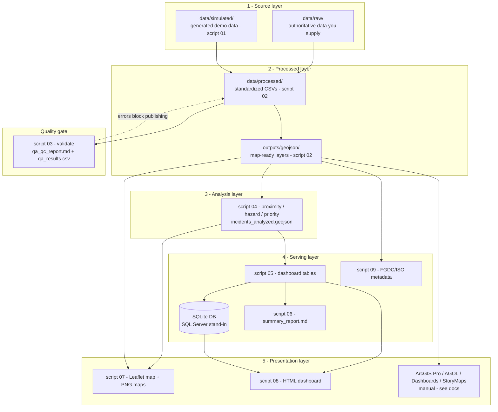
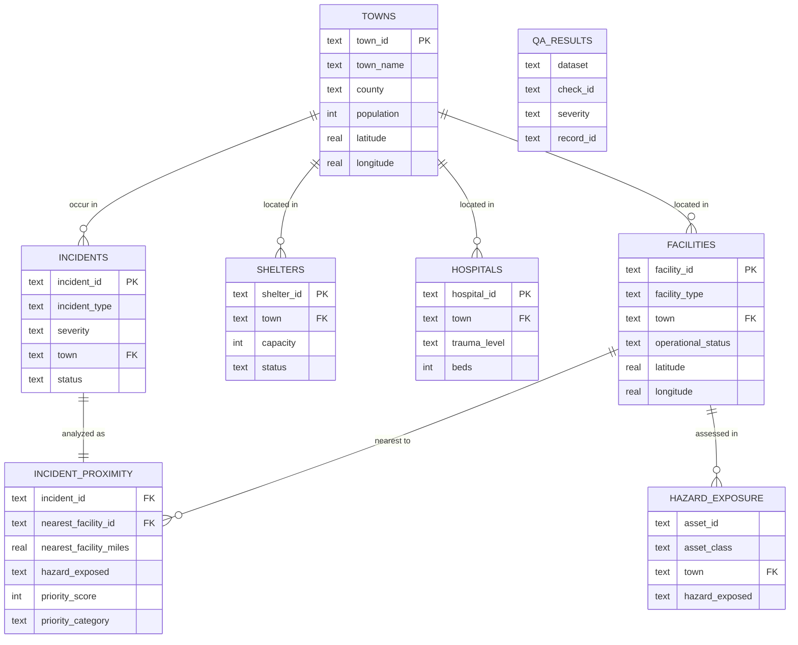

# Architecture

> **This is a portfolio demonstration using public or simulated data. It is not an official emergency management product and should not be used for operational decision-making.**

Diagrams of how the project is put together. (GitHub renders the Mermaid blocks
below as diagrams.)

## Pipeline & data flow

A layered design — sources → processed → analysis → serving → presentation —
mirroring an enterprise GIS stack (e.g. ArcGIS Enterprise / SDE / SQL Server).

## Data model (relational schema)

The SQLite schema (`sql/schema.sql`) loaded by script 05. A town reference table
is the spatial backbone; incidents/facilities/shelters/hospitals relate to it by
town name; derived analysis and QA tables hang off the operational tables.

## Pipeline stages at a glance

## How this maps to the Esri / enterprise stack

| This project (open-source) | Enterprise equivalent |
|---|---|
| `data/processed/` + `outputs/geojson/` | ArcGIS feature classes in a file/enterprise geodatabase |
| SQLite (`outputs/public_safety_gis.sqlite`) | SQL Server enterprise geodatabase (SDE) |
| `scripts/04` proximity / overlay | ArcGIS Pro `GenerateNearTable`, `Buffer`, `SelectLayerByLocation` |
| `outputs/maps/interactive_map.html` | ArcGIS Online web map + hosted feature layers |
| `outputs/dashboard/index.html` | ArcGIS Dashboards |
| `scripts/01`–`09` orchestration | ArcPy / ArcGIS Python API + scheduled tasks |
| `outputs/metadata/` | ArcGIS metadata (FGDC/ISO 19115) |
